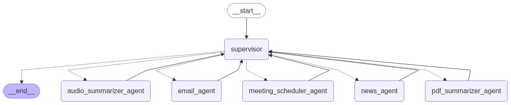

# 🎯 TaskMaster AI - Agentic AI System

**An intelligent multi-agent AI system that orchestrates specialized agents to handle complex tasks through a supervisor pattern**


</div>

## 🚀 Project Overview

**TaskMaster AI** is a production-ready agentic AI system that uses a **supervisor pattern** to orchestrate multiple specialized AI agents. The system intelligently delegates tasks to the appropriate agent based on user requests, enabling complex workflows like document summarization, email automation, news fetching, meeting scheduling, and sentiment analysis.

### How It Works

1. **User Request**: User submits a task (with optional file upload) through the web interface
2. **Supervisor Analysis**: The supervisor agent analyzes the request and determines which specialized agent(s) to invoke
3. **Agent Execution**: Specialized agents process the task using their specific tools and capabilities
4. **Workflow Orchestration**: The supervisor coordinates multi-step workflows (e.g., summarize PDF → send email)
5. **Response Generation**: Final response is returned to the user with complete workflow visualization

### System Architecture



The system consists of:

- **1 Supervisor Agent** 🎯: Orchestrates and delegates tasks to specialized agents
- **6 Specialized Agents**: Each with unique capabilities and tools
  - 📄 **PDF Summarizer**: Extracts and summarizes PDF documents
  - 🎵 **Audio Summarizer**: Transcribes and summarizes audio files
  - 📰 **News Fetcher**: Searches and summarizes latest news articles
  - 📧 **Email Sender**: Sends professional emails with formatted content
  - 📅 **Meeting Scheduler**: Manages calendar events via Google Calendar API
  - 💭 **Sentiment Analyzer**: Analyzes user feedback and collects ratings

---

## ✨ Features

### Core Capabilities

- ✅ **Multi-Agent Orchestration**: Intelligent task delegation through supervisor pattern
- ✅ **PDF Document Processing**: Automatic summarization of PDF files
- ✅ **Audio File Transcription**: Whisper-based audio transcription and summarization
- ✅ **Real-time News Search**: Fetch and summarize latest news using Tavily API
- ✅ **Email Automation**: Send professional HTML-formatted emails
- ✅ **Calendar Integration**: Schedule meetings with Google Calendar API
- ✅ **Sentiment Analysis**: Analyze user feedback and collect ratings
- ✅ **Workflow Visualization**: Real-time visualization of agent workflows
- ✅ **File Upload Support**: Upload PDFs and audio files for processing
- ✅ **Session Management**: Maintain conversation context across requests

### User Interface

- 🎨 Modern, responsive React frontend
- 📊 Step-by-step workflow visualization
- 🏷️ Color-coded agent badges
- 📱 Mobile-friendly design
- ⚡ Real-time status updates

---

## 🏗️ Architecture

### Supervisor Pattern

The system implements a **hierarchical supervisor pattern** where:

1. **Supervisor Agent** receives all user requests
2. Analyzes the intent and determines the required workflow
3. Delegates to specialized agents using handoff tools
4. Coordinates multi-step processes (e.g., summarize → email)
5. Aggregates results and generates final response

### Agent Communication Flow

```
User Request
    ↓
Supervisor Agent (GPT-4o)
    ↓
[Analyzes Request]
    ↓
┌───────────────────────────────────────┐
│   Handoff Tool Selection              │
├───────────────────────────────────────┤
│ • PDF → pdf_summarizer_agent          │
│ • Audio → audio_summarizer_agent      │
│ • News → news_agent                   │
│ • Email → email_agent                 │
│ • Meeting → meeting_scheduler_agent   │
└───────────────────────────────────────┘
    ↓
Specialized Agent Execution
    ↓
Tool Invocation
    ↓
Result Return to Supervisor
    ↓
Final Response Generation
```

### LangGraph State Management

The system uses **LangGraph** for stateful agent orchestration:

- **MessagesState**: Maintains conversation history
- **StateGraph**: Manages agent transitions and workflow
- **ReAct Agents**: Each agent uses reasoning + acting pattern
- **Tool Integration**: Agents call specialized tools for execution

---

## 🛠️ Tech Stack

### Backend

| Category | Technology | Version |
|----------|-----------|---------|
| **Language** | Python | 3.10 |
| **Web Framework** | FastAPI | 0.116.0 |
| **ASGI Server** | Uvicorn | 0.35.0 |
| **Agent Framework** | LangGraph | 0.5.1 |
| **LLM Framework** | LangChain | 0.3.26+ |
| **LLM Providers** | OpenAI, Google GenAI | - |
| **Models** | GPT-3.5-turbo, Gemini 2.0 Flash | - |
| **Document Processing** | PyPDFLoader | - |
| **Audio Processing** | OpenAI Whisper | Latest |
| **News Search** | Tavily API | - |
| **Calendar API** | Google Calendar v3 | - |
| **Email** | SMTP (smtplib) | - |
| **Environment** | python-dotenv | 1.1.1 |
| **Validation** | Pydantic | 2.11.7 |
| **HTTP Client** | httpx | 0.28.1 |

### Frontend

| Category | Technology | Version |
|----------|-----------|---------|
| **Language** | JavaScript (ES6+) | - |
| **Framework** | React | 19.2.0 |
| **Build Tool** | Vite | 7.2.4 |
| **Package Manager** | npm | - |
| **Styling** | CSS3 | - |
| **HTTP Client** | Fetch API | - |

### Development Tools

- **Package Manager**: pip, npm
- **Containerization**: Docker
- **Version Control**: Git
- **Linting**: ESLint (Frontend)

---

## 🔧 Backend Setup

### Prerequisites

- Python 3.10 or higher
- pip (Python package manager)
- Docker (optional, for containerized deployment)
- Google Cloud Project (for Calendar API)
- API Keys:
  - OpenAI API Key
  - Google GenAI API Key
  - Tavily API Key

### Step 1: Clone the Repository

```bash
git clone https://github.com/moditag20/TaskMaster_AI.git
cd TaskMaster_AI
```

### Step 2: Navigate to Backend Directory

```bash
cd Backend
```


### Step 3: Configure Environment Variables

Create a `.env` file in the `Backend/` directory:

```bash
# Backend/.env
```

Copy the following template and fill in your values:

```env
# OpenAI Configuration
OPENAI_API_KEY=sk-proj-your-openai-api-key-here

# Google GenAI Configuration (for Gemini models)
GOOGLE_API_KEY=your-google-api-key-here

# Tavily API Configuration (for news search)
TAVILY_API_KEY=tvly-your-tavily-api-key-here

# Email Configuration
EMAIL_HOST=smtp.gmail.com
EMAIL_PORT=587
EMAIL_USER=your-email@gmail.com
EMAIL_PASS=your-app-specific-password

# Optional: Server Configuration
PORT=8000
HOST=0.0.0.0
```

### Step 4: Google Calendar Setup (Optional)

> **⚠️ Important**: If you want to use the Meeting Scheduler agent, you need to set up Google Calendar API credentials. This is **optional** - you can skip this step if you don't need calendar functionality.

The Meeting Scheduler agent requires two files:
- **`credentials.json`**: OAuth 2.0 client credentials (you download this)
- **`token.pickle`**: Generated authentication token (created automatically on first run)

#### File Names and Locations

| File | Name | Location | Source |
|------|------|----------|--------|
| OAuth Credentials | `credentials.json` | `Backend/agents/` | Download from Google Cloud Console |
| Access Token | `token.pickle` | `Backend/agents/` | Auto-generated on first run |

#### Step-by-Step Guide

##### Step 4.1: Create a Google Cloud Project

1. Go to [Google Cloud Console](https://console.cloud.google.com/)
2. Click the project dropdown at the top of the page
3. Click **"New Project"**
4. Enter a project name (e.g., "TaskMaster AI")
5. Click **"Create"**
6. Wait for the project to be created and select it

##### Step 4.2: Enable Google Calendar API

1. In the Google Cloud Console, navigate to **"APIs & Services"** → **"Library"**
2. Search for **"Google Calendar API"**
3. Click on **"Google Calendar API"**
4. Click **"Enable"** button
5. Wait for the API to be enabled (this may take a few moments)

##### Step 4.3: Create OAuth 2.0 Credentials

1. Navigate to **"APIs & Services"** → **"Credentials"**
2. Click **"+ CREATE CREDENTIALS"** at the top
3. Select **"OAuth client ID"**
4. If prompted, configure the OAuth consent screen:
   - Choose **"External"** user type (unless you have a Google Workspace)
   - Click **"Create"**
   - Fill in the required fields:
     - **App name**: TaskMaster AI (or your choice)
     - **User support email**: Your email address
     - **Developer contact information**: Your email address
   - Click **"Save and Continue"**
   - On **"Scopes"** page, click **"Save and Continue"**
   - On **"Test users"** page, click **"Save and Continue"**
   - Review and click **"Back to Dashboard"**

5. Back at the Credentials page, click **"+ CREATE CREDENTIALS"** → **"OAuth client ID"** again
6. Select **"Desktop app"** as the application type
7. Enter a name for your OAuth client (e.g., "TaskMaster AI Desktop Client")
8. Click **"Create"**
9. A popup will appear with your **Client ID** and **Client Secret**
10. Click **"Download JSON"** button
   - This downloads a file (usually named something like `client_secret_xxx.json`)
   - **Rename this file to `credentials.json`**

##### Step 4.4: Place credentials.json in the Correct Location

1. **Navigate to the Backend/agents directory:**
   ```bash
   cd Backend/agents
   ```

2. **Copy the downloaded credentials.json file to this location:**
   
   **Windows:**
   ```powershell
   copy C:\Users\YourName\Downloads\credentials.json Backend\agents\credentials.json
   ```
   
   **macOS/Linux:**
   ```bash
   cp ~/Downloads/credentials.json Backend/agents/credentials.json
   ```
   
   Or simply drag and drop the file into `Backend/agents/` folder using your file explorer.

3. **Verify the file is in the correct location:**
   ```bash
   # Windows
   dir Backend\agents\credentials.json
   
   # macOS/Linux
   ls Backend/agents/credentials.json
   ```

   You should see `credentials.json` listed.

##### Step 4.5: First-Time Authentication (Generate token.pickle)

The `token.pickle` file is **automatically generated** on the first use of the Meeting Scheduler agent. Here's what happens:

1. **When you first use the meeting scheduler**, the code will:
   - Detect that `token.pickle` doesn't exist
   - Open a browser window automatically
   - Ask you to sign in to your Google account
   - Request permission to access your Google Calendar
   - Generate and save `token.pickle` in `Backend/agents/` directory

2. **To trigger this manually** (optional), you can run:
   ```bash
   cd Backend
   python -c "from agents.meeting_scheduler import get_calendar_service; get_calendar_service()"
   ```

3. **During authentication:**
   - A browser window will open
   - Sign in with the Google account whose calendar you want to manage
   - Click **"Allow"** to grant calendar access
   - The browser may show "The authentication flow has completed" - you can close it
   - The `token.pickle` file will be created automatically

4. **After authentication:**
   - The `token.pickle` file is created in `Backend/agents/`
   - This file stores your access token and refresh token
   - Future requests will use this token automatically
   - The token refreshes automatically when it expires

##### Step 4.6: Verify Setup

To verify everything is working:

```bash
cd Backend
python -c "from agents.meeting_scheduler import get_calendar_service; service = get_calendar_service(); print('✅ Google Calendar API connected successfully!')"
```

If successful, you'll see the success message. If there are errors, check the troubleshooting section below.


### Step 5: Run

```bash
# Windows
docker build -t agenticai .
docker run -p 8000:8000 agenticai
```

Open your browser and navigate to:
- API Documentation: `http://localhost:8000/docs`
- Alternative Docs: `http://localhost:8000/redoc`

You should see the FastAPI interactive documentation.

## 💻 Frontend Setup

### Prerequisites

- Node.js 16+ and npm/yarn
- Backend API running (default: `http://localhost:8000`)

### Step 1: Navigate to Frontend Directory

```bash
cd Frontend
```

### Step 2: Install Dependencies

```bash
npm install
```

### Step 3: Configure Environment Variables (Optional)

Create a `.env` file in the `Frontend/` directory:

```env
VITE_API_BASE_URL=http://localhost:8000
```

> **Note**: If not specified, the frontend defaults to `http://localhost:9000`. Make sure it matches your backend URL.

### Step 4: Start Development Server

```bash
npm run dev
```

The development server will start at `http://localhost:5174` (or another available port).

### Step 5: Access the Application

Open your browser and navigate to:
- Frontend: `http://localhost:5174`


## 🔄 Agentic AI Workflow

### How the Supervisor Delegates Tasks

#### 1. Request Analysis Phase

```
User Request: "Summarize this PDF and email it to john@example.com"
    ↓
Supervisor receives request with file path
    ↓
Supervisor analyzes intent:
  - Primary task: PDF summarization
  - Secondary task: Email delivery
  - Required agents: PDF Summarizer → Email Sender
```

#### 2. Agent Selection & Handoff

The supervisor uses **handoff tools** to transfer control:

```python
# Supervisor has access to these handoff tools:
- transfer_to_pdf_summarizer_agent
- transfer_to_audio_summarizer_agent
- transfer_to_news_agent
- transfer_to_email_agent
- transfer_to_meeting_scheduler_agent
```

#### 3. Execution Flow Example

**Scenario: Summarize PDF and Email**

```
Step 1: Supervisor → PDF Summarizer
├─ Input: File path from user upload
├─ Tool Call: summarize_pdf(file_path)
├─ Output: Summary text
└─ Return to: Supervisor

Step 2: Supervisor → Email Agent
├─ Input: Summary text + recipient email
├─ Tool Call: emailer_tool(receiver, body, subject)
├─ Output: Email sent confirmation
└─ Return to: Supervisor

Step 3: Supervisor → Final Response
└─ Aggregates all results
└─ Returns to user
```

#### 4. Planning & Tool Calls

Each agent uses **ReAct (Reasoning + Acting)** pattern:

1. **Reasoning**: Agent analyzes current state and determines next action
2. **Tool Selection**: Chooses appropriate tool based on task
3. **Tool Execution**: Invokes tool with proper parameters
4. **Result Processing**: Processes tool output
5. **Response Generation**: Returns formatted response or continues workflow

#### 5. State Management

LangGraph maintains state throughout the workflow:

- **Messages Array**: All user inputs, agent responses, and tool results
- **Agent Context**: Current agent, previous steps, intermediate results
- **Tool Results**: Stored in state for subsequent agents to access
- **Summary/News Storage**: Key outputs stored for email agent access

### Workflow Examples

#### Example 1: News Fetching and Email

```python
User: "Get latest AI news and email it to me at user@example.com"

Workflow:
1. Supervisor → News Agent
   - Tool: web_search("latest AI news")
   - Result: News articles with summaries

2. News Agent → Supervisor
   - Returns: Formatted news summary

3. Supervisor → Email Agent
   - Tool: emailer_tool("user@example.com", news_summary, "Latest AI News")
   - Result: Email sent successfully

4. Supervisor → User
   - Final: "News summary sent to user@example.com"
```

#### Example 2: Meeting Scheduling

```python
User: "Schedule a meeting on July 15th at 9:30 AM for 1 hour"

Workflow:
1. Supervisor → Meeting Scheduler Agent
   - Tool: tool_suggest_booking_for_boss("2025-07-15T09:30:00|60")
   - Logic: Check calendar availability

2. Meeting Scheduler Agent:
   - If available: Books meeting via Google Calendar API
   - If unavailable: Finds next available slot
   - Returns: Booking confirmation or alternative time

3. Supervisor → User
   - Final: Meeting confirmation or alternative suggestion
```

### Backend Orchestration

The FastAPI backend (`main.py`) orchestrates the workflow:

```python
@app.post("/supervisor")
async def run_supervisor(content: str, file: Optional[UploadFile]):
    # 1. Handle file upload if present
    # 2. Build message with file path
    # 3. Invoke supervisor_graph with messages
    # 4. Supervisor delegates to agents
    # 5. Agents execute and return results
    # 6. Return final state to frontend
```

**Key Components:**

- **supervisor_graph**: LangGraph compiled workflow
- **StateGraph**: Manages agent transitions
- **MessagesState**: Maintains conversation history
- **Agent Nodes**: Individual agent implementations
- **Tool Integration**: Each agent has specialized tools

---

## 🎯 Key Agent Capabilities

### 📄 PDF Summarizer Agent

- **Model**: Gemini 2.0 Flash
- **Tool**: `summarize_pdf(file_path)`
- **Capability**: Extracts text from PDF and generates concise summary
- **Use Case**: Document analysis, report summarization

### 🎵 Audio Summarizer Agent

- **Model**: Gemini 2.0 Flash + Whisper
- **Tool**: `summarize_audio(file_path)`
- **Capability**: Transcribes audio and summarizes spoken content
- **Use Case**: Meeting notes, podcast summaries, voice memo analysis

### 📰 News Fetcher Agent

- **Model**: GPT-3.5-turbo
- **Tool**: `web_search(query)`
- **Capability**: Searches latest news and formats results
- **Use Case**: News aggregation, research, current events

### 📧 Email Sender Agent

- **Model**: GPT-3.5-turbo
- **Tool**: `emailer_tool(receiver, body, subject)`
- **Capability**: Sends professional HTML-formatted emails
- **Use Case**: Automated email delivery, notification sending

### 📅 Meeting Scheduler Agent

- **Model**: GPT-3.5-turbo
- **Tool**: `tool_suggest_booking_for_boss(time)`
- **Capability**: Checks calendar and schedules meetings
- **Use Case**: Calendar management, meeting coordination

### 💭 Sentiment Analyzer Agent

- **Model**: Gemini 2.0 Flash
- **Tools**: `respond_positive()`, `respond_negative()`
- **Capability**: Analyzes sentiment and collects ratings
- **Use Case**: Feedback analysis, customer service

---
